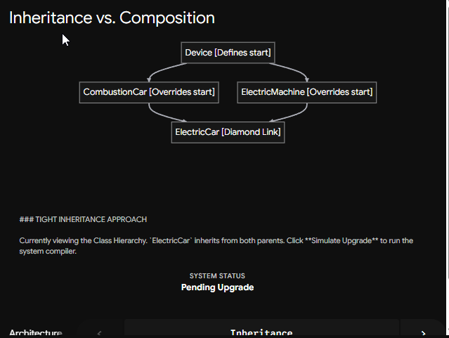
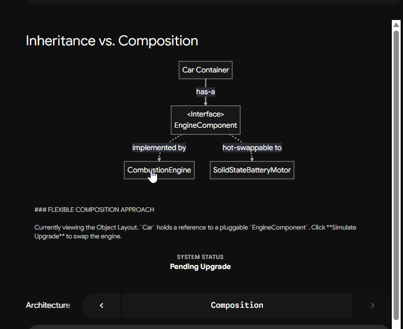
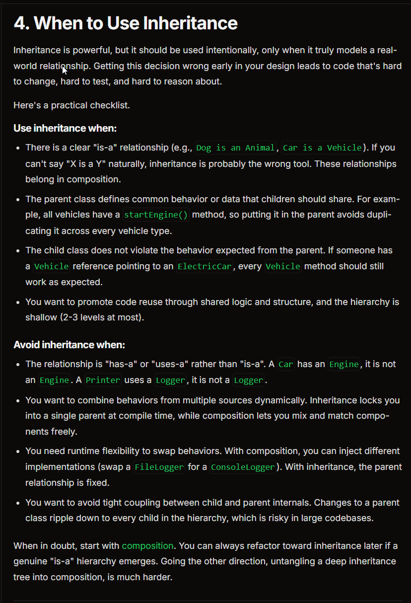

https://algomaster.io/learn/lld/inheritance

Here is the complete, comprehensive master study note. This version integrates every single element we have broken down: the core definitions, the production code, the structural limitations, the mitigation via composition, and—crucially—**the architectural "why"** regarding separation of concerns, testing, and interview strategy.

---

# Master Study Note: Inheritance, Composition, and System Architecture

### 1. Core Architectural Definitions

* **Inheritance (`extends` / Subclassing):** An **Is-A** relationship. It is an object-oriented mechanism where a child class derives directly from a parent class to inherit its fields, data state, and internal method logic.
* **Composition (`has-a` / Component Design):** A **Has-A** or **Uses-A** relationship. Instead of inheriting behavior from a parent, a class references independent objects as attributes and delegates specific tasks to them.

---

### 2. The Structural Limitations of Inheritance

While university courses often overemphasize inheritance hierarchies, enterprise software development treats heavy inheritance as an anti-pattern due to three critical flaws:

* **The Diamond Problem (Multiple Inheritance Conflict):** If a class attempts to inherit from two separate parents (e.g., `class ElectricCar(Car, Machine)`) and both parents implement a method with the exact same name (like `start()`), the compiler or runtime environment faces an ambiguity conflict. It cannot deterministically choose which parent's logic to execute.
* **Fragile Base Class (Tight Coupling):** A child class is completely dependent on its parent's implementation details. If a senior engineer modifies a base parent class to fix a bug, it can cause a catastrophic ripple effect, silently breaking dozens of subclasses down the line.
* **Compile-Time Rigidity:** Inheritance relationships are hardcoded at compile-time. An object cannot dynamically swap out its parent class or alter its core inherited behaviors while the application is running.

---

### 3. The Composition Solution (How It Solves the Flaws)

Composition bypasses the Diamond Problem and tight coupling entirely by converting structural dependencies into isolated components.

Instead of forcing `ElectricCar` to inherit all internal mechanics from a generic `Machine` class, the `ElectricCar` simply maintains a private instance of a `Machine` object. It handles its responsibilities by *delegating* tasks to that component.

---

### 4. Production-Grade Code Example (Python)

Here is how you implement this design pattern cleanly using Python's `abc` (Abstract Base Class) module to enforce contracts:

```python
from abc import ABC, abstractmethod

# --- THE INHERITANCE LAYER (Shared Identity & Identity State) ---
class Vehicle:
    def __init__(self, brand: str):
        self.brand = brand  # Structural state shared by all vehicles

    def transport(self) -> None:
        print(f"The {self.brand} vehicle is moving from point A to B.")


# --- THE COMPOSITION LAYER (Interchangeable Infrastructure Behaviors) ---
class MotorComponent(ABC): # main interface
    @abstractmethod
    def spin(self) -> None:
        """Enforces a strict contract for any motor behavior."""
        pass

class ElectricMotor(MotorComponent):
    def spin(self) -> None:
        # Isolated infrastructure details for electric systems
        print("Drawing electricity from battery pack. Motor spinning silently.")

class GasEngine(MotorComponent):
    def spin(self) -> None:
        # Isolated infrastructure details for combustion systems
        print("Injecting fuel into cylinders. Pistons firing with combustion noise.")


# --- THE RESOLUTION ---
# ElectricCar IS-A Vehicle (Inheritance) but HAS-A MotorComponent (Composition)
class ElectricCar(Vehicle):
    def __init__(self, brand: str, motor: MotorComponent):
        super().__init__(brand)  # Reuses parent initialization code cleanly
        self.motor = motor        # Injects the specific behavior component

    def drive(self) -> None:
        # Single Responsibility: The car orchestrates the action,
        # but delegates the mechanical setup to the specialized component.
        self.motor.spin()
        print(f"The {self.brand} electric car cruises forward smoothly.")

```

---

### 5. The Deep Architectural "Why" (Why We Design Systems This Way)

When staff engineers review code or conduct system design interviews, they look for this specific setup for three foundational reasons:

#### **A. Separation of Concerns (Single Responsibility Principle)**

A class should have exactly one reason to change. In our code:

* The `ElectricCar` class owns high-level *business logic* (managing its brand identity, logging trips, orchestrating driving sequences).
* The `ElectricMotor` class owns low-level *infrastructure logic* (voltage control, thermal monitoring, low-level mechanics).

If the engineering team switches from lithium-ion to solid-state batteries, you only modify `ElectricMotor`. The core `ElectricCar` class remains entirely untouched, eliminating the risk of introducing regression bugs to your primary business workflows.

#### **B. Runtime Flexibility and Extensibility**

Inheritance locks you into a choice. Composition allows you to hot-swap system components dynamically while the application is actively running:

```python
# Initialize with a standard motor
my_car = ElectricCar("Model S", ElectricMotor())
my_car.drive()

# If an upgrade is needed, we swap components seamlessly at runtime 
# without altering the ElectricCar class code base:
class HydrogenMotor(MotorComponent):
    def spin(self) -> None:
        print("Converting hydrogen fuel cells to current. Whisper quiet thrust.")

my_car.motor = HydrogenMotor()
my_car.drive()

```

#### **C. Mandatory Unit Testability**

At major tech companies, code cannot be deployed without automated unit tests. If your class relies on tight inheritance or direct instantiation of heavy infrastructure components (like objects making actual network calls, hitting databases, or managing real hardware), testing becomes a bottleneck.

By using composition and interfaces, you can instantly inject a harmless "Mock" component during a test execution flow:

```python
class MockMotor(MotorComponent):
    def spin(self) -> None:
        # No physical components or real battery drains are triggered here
        print("[TEST] Mock motor spin simulated successfully instantly.")

# Safe, lightning-fast isolated unit test with zero side effects
test_car = ElectricCar("TestBench", MockMotor())
test_car.drive()

```






---